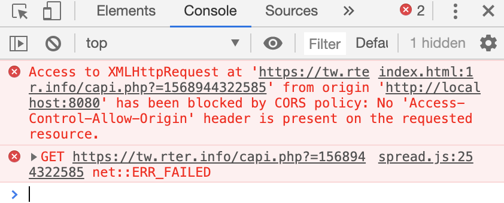
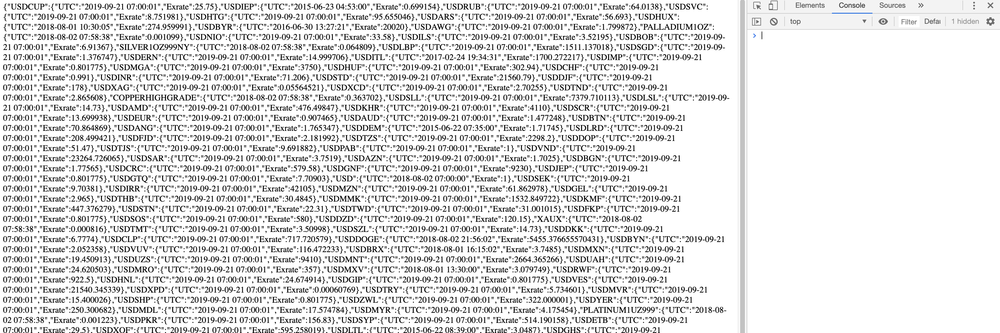

# 如何解決跨網域存取被拒絕問題
在前端開發時使用 ajax、axios、fecth等HTTP Request來存取API資料時有時會遇到以下情況導致無法正常讀取API內容。

>No 'Access-Control-Allow-Origin' header is present on the requested resource.



該如何解決這個問題呢？這邊有兩種解決方式，第一種是叫後端API的開發者開放跨網域cors權限。以 `Node.js` 為例可以參考[這篇](https://andy6804tw.github.io/2017/12/27/middleware-tutorial/#%E8%B7%A8%E4%BE%86%E6%BA%90%E8%B3%87%E6%BA%90%E5%85%B1%E4%BA%AB-cors)文章。文中會解釋什麼是跨來源資源共享(cors)。第二種方式是使用第三方資源來協助存取[cors-anywhere](https://github.com/Rob--W/cors-anywhere/)。`cors-anywhere` 的作者把它部署到 `Heroku` 平台上供大家使用，它的運作原理就是事先使用 `Node.js` 寫好的 API 以非匿名者的身份去存取使用者指定的位置。然後再把撈到的資料回傳。這有點像是你要從台南到台北你騎腳踏車會累死(就等於 No 'Access-Control-Allow-Origin' header is present on the requested resource)，所你騎著腳踏車上火車(cors-anywhere)，火車再幫你載到目的地有異曲同工之妙。

## 使用 `cors-anywhere`
使用方式很簡單就只是將 `cors-anywhere` 所提供的API網址放前面，`\`後面加上你要訪問的API內容網址。下面以 `axios` 為例:

```js
const cors = 'https://cors-anywhere.herokuapp.com/'; // use cors-anywhere to fetch api data
const url = 'https://tw.rter.info/capi.php?=1568944322585'; // origin api url

/** fetch api url by cors-anywhere */
axios.get(`${cors}${url}`)
  .then((response) => {
    const msg = response.data;
    document.body.innerHTML = JSON.stringify(msg)
  },
    (error) => {
    }
  );
```




成功！存取內容～
